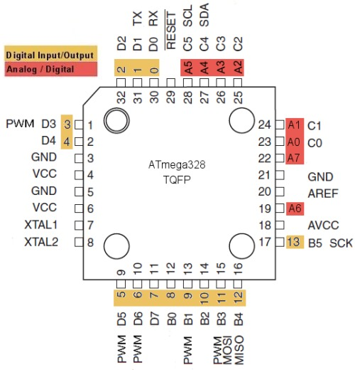
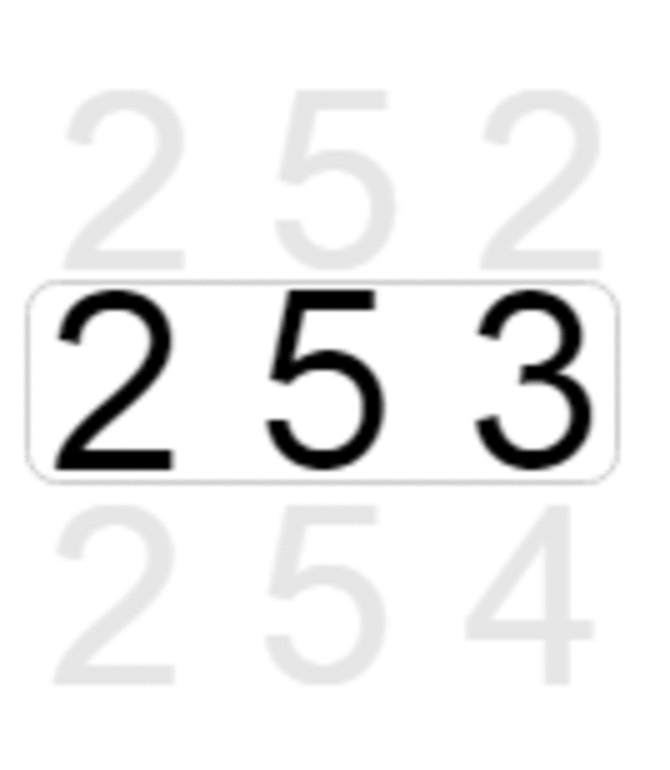

# Blinky Led Application

Blinky led application using timer.(whitout delay function)

I'm using Raspberry Pi Zero W GPIOs as ICSP programmer. Target device is ATmega328p-au based Arduino Nano(CH340 chip not working).



## Wiring
Rpi	| Arduino ICSP
---	| ---
+5V	| VCC
GND	| GND
GPIO 23 | MOSI
GPIO 18 | MISO
GPIO 24 | SCK
GPIO 12 | RESET

Also you can use Arduino.

# Makefile 

### Help

`make help`	:print commands.

### Hex

`make hex`	:Compile C file to .hex file.

In this project available with delay and without delay blinky led code. Which one you want, edit Makefile.

```makefile
# Project name.
src=blink_timer
#src=blink
```
### Flash  

Available 2 flash method.

* `make flash_pi`	:Flash hex file to Arduino using Raspberry pi GPIOs

* `make flash_arduino`	:Flash hex file to Arduino.

For `flash_arduino` you must be edit makefile for change Arduino serial port variable devPot

For `flash_pi` check avrdude configuration file location.

```makefile
avrType=atmega328p # cpu
avrFreq=16000000 # 16MHz crystal freq.
programmerType=pi_1

devPort=/dev/USB0
avrConf=/home/pi/Project/avr/blink_whitout_delay/avrdude.conf
cflags=-g -DF_CPU=$(avrFreq) -Wall -Os -Werror -Wextra
```

# AVR Timer Examination


Atmega328 has three different timers of which the simplest timer is TIMER0. TIMER0 resolution is 8 bit(0-255). Timer0 count increasing with every clock pulse. Clock pulse generating by crystal oscilator. Arduino Nano has 16MHz oscilator. It's means every pulse, takes 1/16000000 = 0.625 us

The Prescaler is used to divide clock frequncy and produce a clock for timer.

## TIMER0 Register.

### Timer Counter Control Register 0 (TCCR0)

Bit 		| 7 	| 6 	| 5 	| 4 	| 3 	| 2 	| 1 	| 0
---		| --- 	|--- 	| --- 	| --- 	| --- 	| --- 	| --- 	| --- 
Name		| FOC0 	| WGM00 | COM01 | COM00 | WGM01 | CS02 	| CS01 	| CS00
Inital Value 	|0	|0	|0	|0	|0	|0	|0	|0

### Timer/Counter 0 (TCNT0)

TCNT0 register hold the timer count and overflows. If timer count reach 255 and overflow, Timer Overflow Flag (TOV) is sets.




